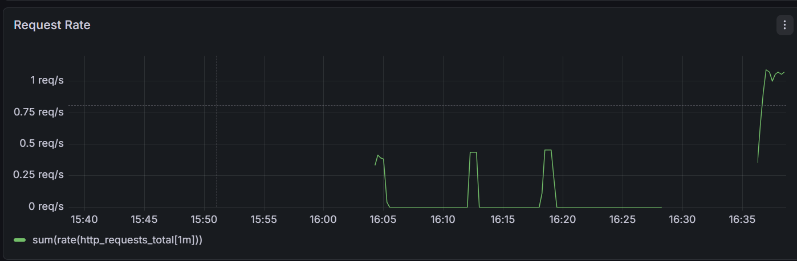
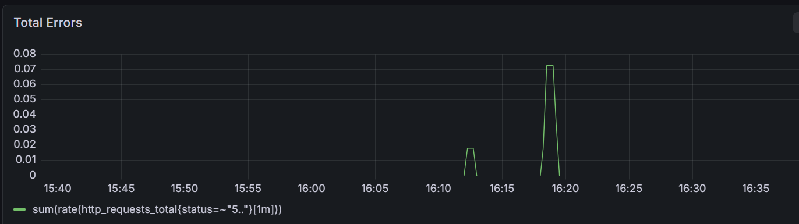
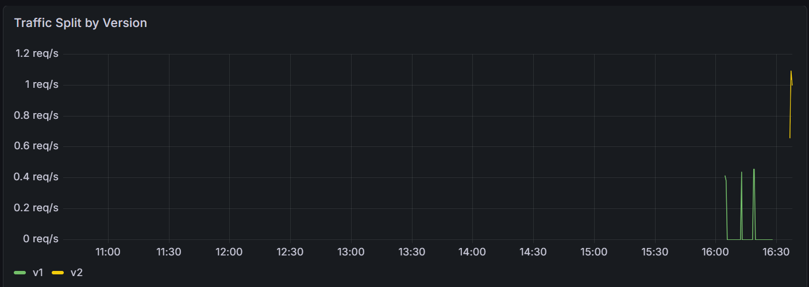
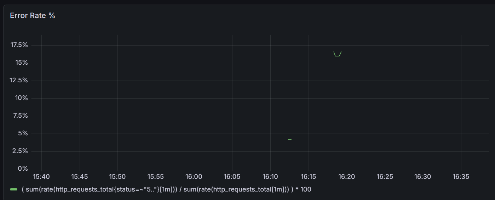

# order-api-sre – Canary Deployment & Observability Demo

## Overview

This project demonstrates a **canary deployment workflow** using Kubernetes, Flagger, and Traefik, along with **observability** via Prometheus and Grafana. The sample application (`order-api`) simulates a simple order API, and the setup showcases:

- Automated **canary rollouts** for safe deployments
- Real-time metrics collection using **Prometheus**
- **Visualization dashboards** with Grafana
- Routing and traffic splitting with **Traefik ingress**
- Containerized deployments with **Docker**

---

## Features

- Canary deployments using Flagger
- Metrics monitoring with Prometheus
- Visualization with Grafana dashboards
- Traefik ingress routing
- Dockerized application for portability
- Automated scaling and traffic promotion

---

## Prerequisites

- Kubernetes cluster (e.g., k3s)
- Helm 3 installed
- Docker installed
- `kubectl` configured

---

## Deployment Steps

1. **Apply Namespaces and Resources**

```bash
kubectl apply -f k8s/00-namespace.yaml
kubectl apply -f k8s/app/
kubectl apply -f k8s/monitoring/
kubectl apply -f k8s/middleware.yaml
kubectl apply -f k8s/ingress/
```bash

2. **Ensure all pods are running**

```bash
kubectl get pods -n sre-demo
```bash


## Order-API Application

The `order-api` service is a sample e-commerce backend that simulates order processing. It is deployed in the `sre-demo` namespace and exposes both **HTTP endpoints** and **Prometheus-compatible metrics**.

### Endpoints

| Endpoint                | Method | Description                                  |
|-------------------------|--------|----------------------------------------------|
| `/api/order`            | POST   | Submit a new order with payload `{item, quantity}` |
| `/api/health`           | GET    | Health check endpoint, returns status 200 if service is running |
| `/api/metrics`          | GET    | Prometheus metrics endpoint exposed for monitoring |

### Metrics

The service exposes standard Prometheus metrics, which are scraped by Prometheus for visualization in Grafana. Key metrics include:  

- **`http_requests_total`**: Total number of requests received by the API, labeled by method, path, and status code.  
- **`http_request_latency_seconds`**: Request latency in seconds, useful for performance monitoring.   

These metrics form the basis of the Grafana dashboards, allowing you to track **traffic, errors, and canary rollout progress** in real time.

---

## Grafana Dashboards

The Grafana dashboards provide insights into application performance and canary deployment progress. They are configured to use the **Prometheus** data source (`http://prometheus-service.sre-demo:9090`) and visualize key metrics for the `order-api` service.

### Dashboard Panels

1. **Request Rate**
   - **Metric:** `http_requests_total`
   - **Description:** Shows the number of incoming requests per second to the API. Useful to track traffic trends and monitor load on the service.

   

2. **Total Errors**
   - **Metric:** Aggregated 4xx and 5xx HTTP responses
   - **Description:** Displays the total number of failed requests over time. Helps detect anomalies, spikes in failures, or service degradation.
   
   

3. **Traffic Split by Version**
   - **Metric:** Flagger canary weight / version labels
   - **Description:** Shows the percentage of traffic routed to each version of the service (primary vs canary). Helps track the canary rollout progress in real time.

   

4. **Error Rate %**
   - **Metric:** Calculated as `(Total Errors / Total Requests) * 100`
   - **Description:** Visualizes the proportion of failed requests relative to total traffic. Useful for monitoring service reliability during deployments.

   

---

**Notes:**

- Ensure Prometheus is running and accessible for Grafana to pull metrics.
- Dashboards are designed to monitor the `sre-demo` namespace and track canary deployments managed by Flagger.
- These panels provide a quick overview of API health, traffic distribution, and canary rollout success.